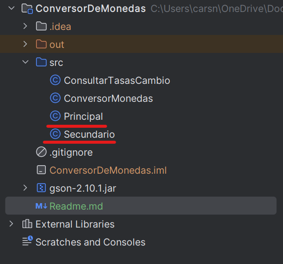
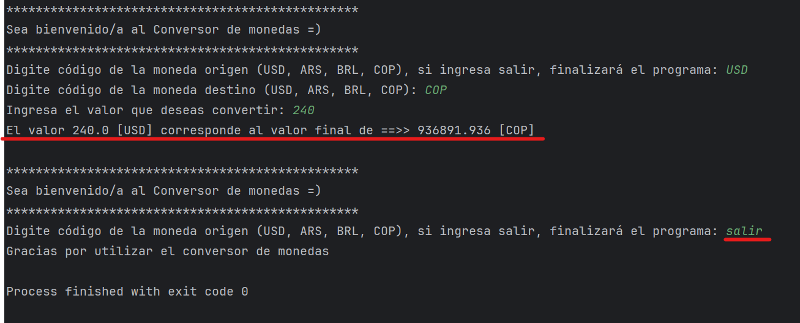

Gracias por consultar la solución propuesta para el reto de conversor de monedas. 
En este repositorio, se encuentran dos clases con métodos ejecutables que permitirá probar el código.

## Primera solución al reto propuesto

En la clase principal, se puede testear y probar la solución del reto usando un menú de opciones. Por ejemplo, en la
siguiente imagen se aprecia el uso del menú, donde se ingresa la opción 5 con el fin de 
convetir 240 dólares a pesos colombianos. 

Para finalizar la ejecución del programa, ingrese un número menor a 1 o mayor o igual a 7.

## Segunda solución al reto propuesto

En la clase secundario, se puede testear la segunda solución al reto, donde a diferencia de la primera opción, se deben
ingresar los códigos de las monedas de origen y de destino. Aprecie en la siguiente imagen como se convierten 240
dólares a pesos colombianos, obteniendo la misma salida de la primera opción.

Para finalizar la ejecución del programa, se debe digitar "salir" cuándo se solicite el código de la moneda de origen. 
Esta segunda opción, válida que los códigos de las monedas a convertir sean válidos, además permite convertir de pesos
argentinos a Colombianos, sin necesidad que una de las monedas involucradas sea el dólar.

## Muchas gracias, agradecería de sus opiniones y comentarios.